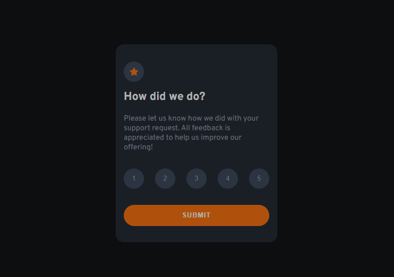

# Frontend Mentor - Interactive rating component solution

This is a solution to the [Interactive rating component challenge on Frontend Mentor](https://www.frontendmentor.io/challenges/interactive-rating-component-koxpeBUmI). Frontend Mentor challenges help you improve your coding skills by building realistic projects.

## Table of contents

- [Frontend Mentor - Interactive rating component solution](#frontend-mentor---interactive-rating-component-solution)
  - [Table of contents](#table-of-contents)
  - [Overview](#overview)
    - [The challenge](#the-challenge)
    - [Screenshot](#screenshot)
    - [Links](#links)
  - [My process](#my-process)
    - [Built with](#built-with)
    - [Useful resources](#useful-resources)
  - [Author](#author)

## Overview

### The challenge

Users should be able to:

- View the optimal layout for the app depending on their device's screen size
- See hover states for all interactive elements on the page
- Select and submit a number rating
- See the "Thank you" card state after submitting a rating

### Screenshot

### Links

- Solution URL: [Interactive rating component Repo](https://github.com/Charlie025x/interactive-rating-component)
- Live Site URL: [Interactive rating component Live site](https://charlie025x.github.io/interactive-rating-component/)

## My process

### Built with

- CSS custom properties
- Flexbox
- SCSS
- Mobile-first workflow
- [React](https://reactjs.org/) - JS library

### Useful resources

- [React onClick function fires on render - stack overflow](https://stackoverflow.com/questions/33846682/react-onclick-function-fires-on-render) - This stack overflow question helped write my React buttons so that they don't execute their functions on page load.

## Author

- Website - [Charlie Alonso](https://charlie-alonso.netlify.app/)
- GitHub - [Charlie025x](https://github.com/Charlie025x)
- Frontend Mentor - [@Charlie025x](https://www.frontendmentor.io/profile/Charlie025x)
- LinkedIn - [Charliealonso002](https://www.linkedin.com/in/charliealonso002/)
